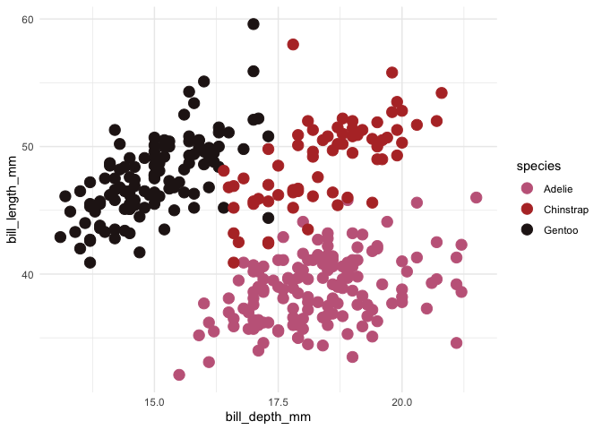
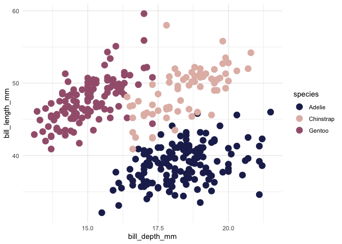
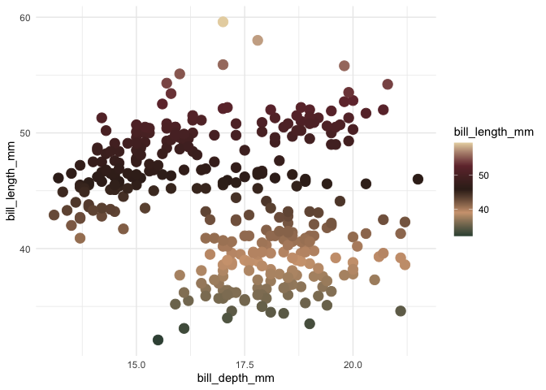
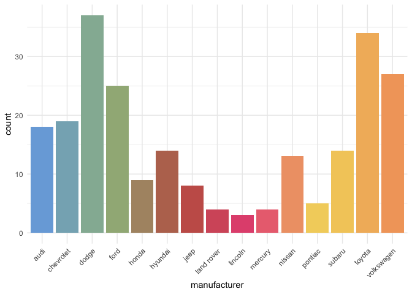

<!-- README.md is generated from README.Rmd. Please edit that file -->

# shakiRa

<!-- badges: start -->
<!-- badges: end -->

A ggplot2 color palette based on Shakira Album Covers.

This package is a fork from [asteves tayloRswift
package](https://github.com/asteves/tayloRswift).

## Installation

You can install the released version of shakiRa with:

``` r
remotes::install_github("camartinezbu/shakiRa")
```

## Examples

Color by discrete variable using default palette based on [Donde Están
Los
Ladrones?](https://en.wikipedia.org/wiki/D%C3%B3nde_Est%C3%A1n_los_Ladrones%3F)

``` r
ggplot(penguins, aes(bill_depth_mm, bill_length_mm, color = species)) +
  geom_point(size = 4) +
  scale_color_shakira()+
  theme_minimal()
```



### Choose a different palette

[Shakira](https://en.wikipedia.org/wiki/Shakira_(album))

``` r
ggplot(penguins, aes(bill_depth_mm, bill_length_mm, color = species)) +
  geom_point(size = 4) +
  scale_color_shakira(palette = "shakira")+
  theme_minimal()
```



### Color by numeric variable

[Fijación Oral
Vol.2](https://en.wikipedia.org/wiki/Oral_Fixation,_Vol._2)

``` r
ggplot(penguins , aes(bill_depth_mm, bill_length_mm,color = bill_length_mm)) +
  geom_point(size = 4) +
  scale_color_shakira(discrete = FALSE, palette ="fijacionOralVol2")+
  theme_minimal()
```



### Fill by discrete variable

[Magia](https://en.wikipedia.org/wiki/Magia_(Shakira_album))

``` r
ggplot(mpg, aes(manufacturer, fill = manufacturer)) +
  geom_bar() +
  theme_minimal()+
  theme(axis.text.x = element_text(angle = 45, hjust = 1)) +
  scale_fill_shakira(palette = "magia", guide = "none")
```



## Palettes


`magia` = “\#79ABDC”, “\#9FBB8B” ,“\#C26151”, “\#E95485”, “\#F4DC6A”,
“\#F2A569”


`peligro` = “\#D1A5B2”,“\#B98184”,“\#E93F37”, “\#714346”,“\#423134”


`piesDescalzos` = “\#9A5071”,“\#ECCDB1”,“\#653739”,
“\#C1832E”,“\#83856D”


`dondeEstanLosLadrones` = “\#C56789”, “\#744356”, “\#B63530”,
“\#E7B89E”, “\#251919”


`servicioDeLavanderia` = “\#DEBB77”, “\#C87153”, “\#9D7458”, “\#2C211D”,
“\#8F502F”


`fijacionOralVol1` = “\#B22E29”, “\#501115”, “\#BC9388”, “\#CEC1C2”,
“\#C29674”


`fijacionOralVol2` = “\#3A5042”, “\#D1A37F”, “\#39261E”, “\#71323A”,
“\#E7D4AF”


`loba` = “\#72C1C8”, “\#EEBD92”, “\#519F86”, “\#CF9762”, “\#CF9762”,
“\#1A0622”


`saleElSol` = “\#835174”, “\#FCE7BB”, “\#DD9386”, “\#C95771”


`shakira` = “\#21285A”, “\#F7F2EF”, “\#CE8679”, “\#A3617C”


`elDorado` = “\#DEC9B1”, “\#EEE4DA”, “\#C8A68A”, “\#D8C582”, “\#B07A6E”
